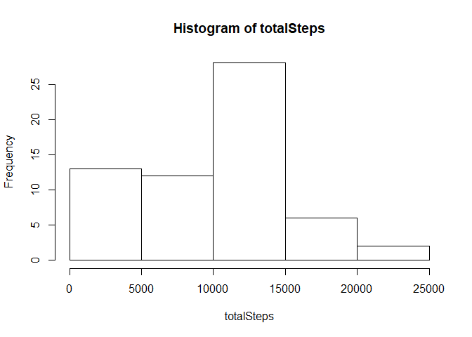
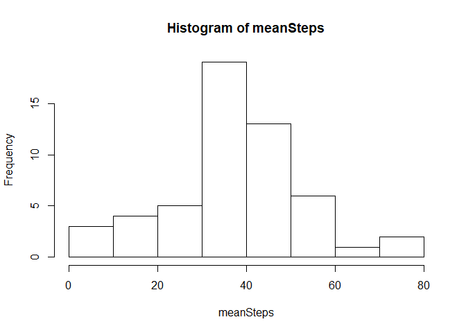
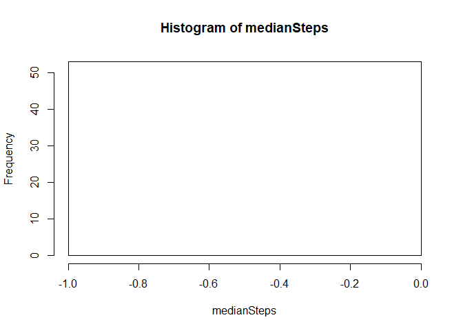
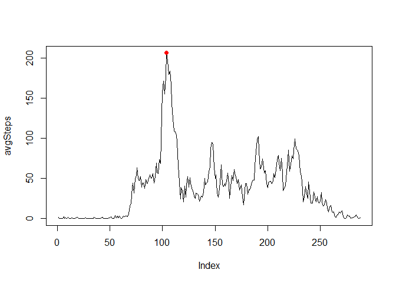
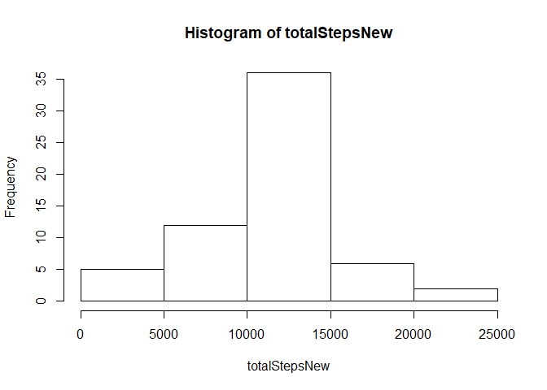
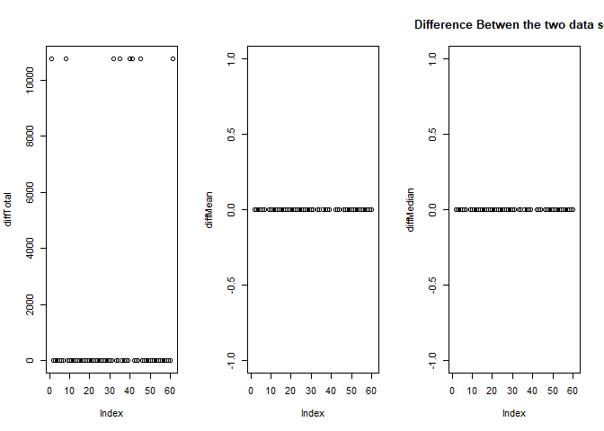
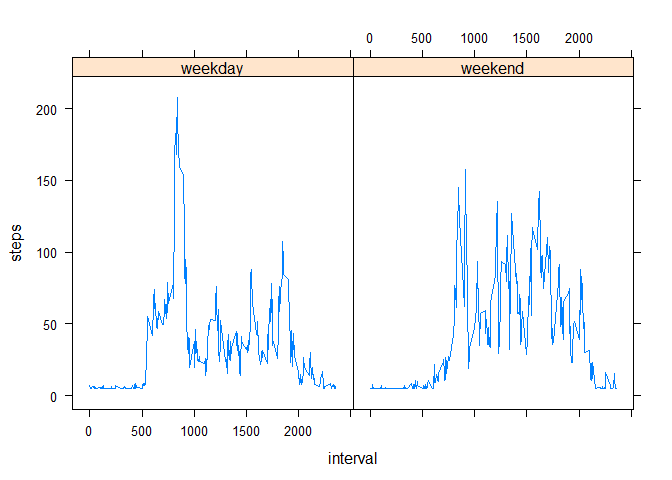

## Loading and preprocessing the data
List of the steps that are performed are :  
1. Read the data  
2. Sum the number of steps taken in a day while removing NA  
3. Plot the histogram of the total number of steps every day  

```r
rawData <- read.csv("./activity/activity.csv")
totalSteps <- tapply(X = rawData$steps, INDEX = rawData$date, FUN = sum, na.rm  = TRUE)
hist(totalSteps)
```

<!-- -->

## What is mean total number of steps taken per day?


```r
meanSteps <- tapply(X = rawData$steps, INDEX = rawData$date, FUN = mean, na.rm  = TRUE)
hist(meanSteps)
```

<!-- -->

```r
medianSteps <- tapply(X = rawData$steps, INDEX = rawData$date, FUN = median, na.rm  = TRUE)
hist(medianSteps)
```

<!-- -->

## What is the average daily activity pattern?


```r
avgSteps <- tapply(X = rawData$steps, INDEX = rawData$interval, FUN = mean, na.rm  = TRUE)
plot(avgSteps, type = "l")
points(which.max(avgSteps),max(avgSteps), col ="red", pch = 16)
```

<!-- -->


The interval that takes the maximum steps is 104.

## Imputing missing values


```r
completeVal <- complete.cases(rawData)
missVal <- length(completeVal) - sum(completeVal)
missValPercentage <- missVal/length(completeVal)
```


The total number of missing values is 2304 or 0.1311475%.  


```r
library(Hmisc)
```

```
## Warning: package 'Hmisc' was built under R version 3.4.2
```

```
## Loading required package: lattice
```

```
## Loading required package: survival
```

```
## Loading required package: Formula
```

```
## Warning: package 'Formula' was built under R version 3.4.1
```

```
## Loading required package: ggplot2
```

```
## Warning: package 'ggplot2' was built under R version 3.4.2
```

```
## 
## Attaching package: 'Hmisc'
```

```
## The following objects are masked from 'package:base':
## 
##     format.pval, round.POSIXt, trunc.POSIXt, units
```

```r
newData <- rawData
newData$steps <- impute(rawData$steps, mean)

totalStepsNew <- tapply(X = newData$steps, INDEX = newData$date, FUN = sum, na.rm  = TRUE)
hist(totalStepsNew)
```

<!-- -->

```r
meanStepsNew <- tapply(X = newData$steps, INDEX = newData$date, FUN = mean, na.rm  = TRUE)
medianStepsNew <- tapply(X = newData$steps, INDEX = newData$date, FUN = median, na.rm  = TRUE)

diffTotal <- totalStepsNew - totalSteps
diffMean <- meanStepsNew - meanSteps
diffMedian <- medianStepsNew - medianSteps
par(mfrow=c(1,3))
plot(diffTotal)
plot(diffMean)
plot(diffMedian)
title(main = "Difference Betwen the two data set")
```

<!-- -->


It can be seen from the plots that there is no great difference between the two dataset.


## Are there differences in activity patterns between weekdays and weekends?


```r
newData$bin <- weekdays(as.Date(newData$date))
classifier <- grep("Saturday|Sunday",newData$bin)
newData$bin[classifier] <- "weekend"
newData$bin[-classifier] <- "weekday"
newData$bin  <- as.factor(newData$bin)
newData <- newData[,c(1,3,4)]
finalData <- aggregate(steps~interval+bin, data = newData, FUN = mean)
xyplot(steps~interval|bin, data = finalData, type = "l")
```

<!-- -->

